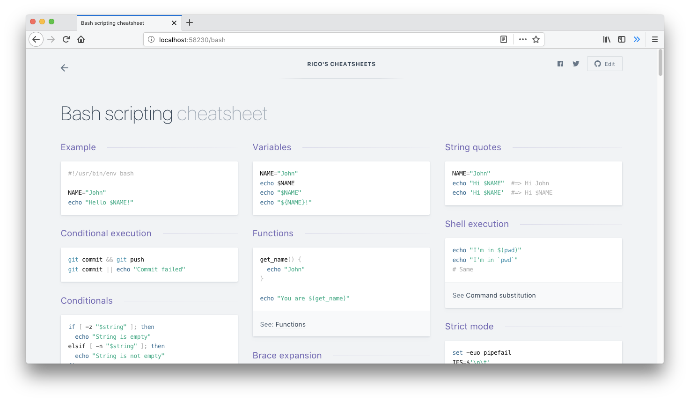

> This is a repo copied from [rstacruz/cheatsheets](https://github.com/rstacruz/cheatsheets).

## Modification
- Home page: pages-list-item will be shown by **title** rather than **slug**. 
- Search: data-js-searchable-item will catch search keyword by slug、title、category、keywords. **Search for Chinese supported.**

--------

<h1 align='center'>Devhints</h1>

<blockquote align='center'>
TL;DR for developer documentation - a ridiculous collection of cheatsheets
</blockquote>

 

 
✨ <b><a href='https://devhints.io/'>devhints.io</a></b> ✨

 
